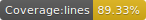

# s-date-range-picker (alpha)

[](https://circleci.com/gh/onx2/s-date-range-picker)
[](https://badge.fury.io/js/s-date-range-picker)





A date range picker built with [Svelte](https://svelte.dev/)

## Getting Started

**In a Svelte App**

- npm: `npm i s-date-range-picker`
- yarn: `yarn add s-date-range-picker`

```svelte
<script>
  import SDateRangePicker from "s-date-range-picker";

  // Manage start and end props from main app component
  let startDate = new Date();
  let endDate = new Date();

  // Update state on apply event
  function onApply({ detail }) {
    startDate = detail.startDate;
    endDate = detail.endDate;
  }
</script>

<SDateRangePicker {startDate} {endDate} on:apply={onApply} />
```

## Development

- Requires [NodeJS](https://nodejs.org/)
- Clone the repo: `git clone https://github.com/onx2/s-date-range-picker.git`
- Enter directory: `cd svelte-date-range-picker`
- Install dpendencies: `yarn`
- Run dev web server: `yarn serve`
- Run tests: `yarn test`
- Run format: `yarn format`
- Run linter: `yarn lint`
- Run build: `yarn build`

## API

### Props / Options
```typescript
applyBtnText: string = "Apply";

cancelBtnText: string = "Camcel";

dateFormat: string = "MMM dd, yyyy";

disabledDates: Date[] = [];

endDate: Date = endOfWeek(new Date());

firstDayOfWeek: string = "sunday";

locale?: Locale = undefined; // date-fns defaults to the system locale.

maxDate: Date = addYears(new Date(), 10);

minDate: Date = subYears(new Date(), 10);

monthDropdown: boolean = false;

monthFormat: string = "MMMM";

nextIcon: string | HTMLElement = "&#9656;"; - ▸

prevIcon: string | HTMLElement = "&#9666;"; // (html | string) - ◂

resetViewBtn: boolean = false;

resetViewBtnText: string | HTMLElement = "&#8602;" // ↚

rtl: boolean = false;

singlePicker: boolean = false;

startDate: Date = startOfWeek(new Date());

timePicker: boolean = false;

timePickerControls: boolean = false;

timePickerIncrement: number = 1;

timePickerSeconds: boolean = false;

today: Date = new Date(); // Used as a reference in predefinedRanges and for underlining in calendar

todayBtn: boolean = false;

todayBtnText: string = "Today";

twoPages: boolean = true;

weekGuides: boolean = false; // Distance in calendar weeks from today

weekNumbers: boolean = false; // Local week numbers

yearDropdown: boolean = false;
```

### Events
```typescript
// Fired when a selection is made (start or end date has been chosen)
selection(): { startDate: Date, endDate: Date};

// Fired when the "Cancel" button is clicked
cancel(): { startDate: Date, endDate: Date};

// Fired when the "Apply" button is clicked
apply(): { startDate: Date, endDate: Date};
```

### Goals
- 100% test coverage
- Event data
- Better accessibility
- Total localization
- AM / PM times
- Maximum span of days option
- Predefined ranges option
- Add storybook for demo site to display different props / options
- Convert to Typescript
- Theming capabilities with a default theme
---

Thanks [geakstr](https://github.com/geakstr/svelte-3-rollup-typescript-vscode) for the [Svelte](https://svelte.dev/) component template!

This project is using [date-fns](https://date-fns.org/) under the hood for date calculations / manipulation.
